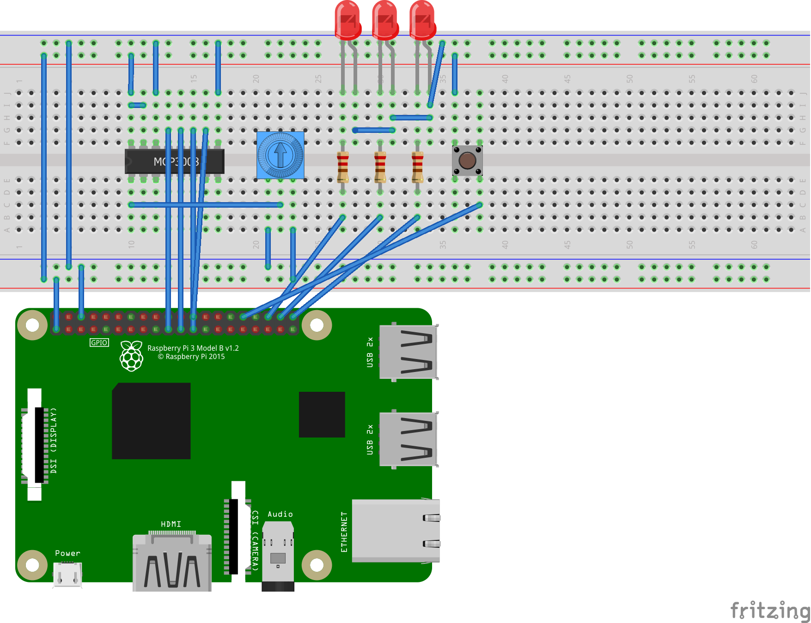

# Using .NET Core for IoT Scenarios

.NET Core can be used to build applications for [IoT](https://en.wikipedia.org/wiki/Internet_of_things) devices and scenarios. IoT applications typically interact with sensors, displays and input devices that require the use of [GPIO pins](https://en.wikipedia.org/wiki/General-purpose_input/output), serial ports or similar hardware. The [Raspberry Pi](https://www.raspberrypi.org/) is commonly used for IoT applications.

## Samples

The following samples demonstrate various scenarios: 

* [Blinking LED](led-blink/README.md)
* [Force Sensitive Resistor usage](force-sensitive-resistor/README.md)
* [More blinking lights](led-more-blinking-lights/README.md)
* [Serial Port - Arduino](serialport-arduino/README.md)

## Libraries

These samples use the [System.Device.Gpio](https://dotnet.myget.org/feed/dotnet-core/package/nuget/System.Device.Gpio) library. It will be supported on Linux and Windows IoT Core. The library is currently in early preview, based on [source in dotnet/iot](https://github.com/dotnet/iot/tree/master/src/System.Device.Gpio).

There are many libraries that are important beyond GPIO, I2C and related fundamental protocols. We are working on a plan where the .NET Team and the community can work together to build up a shared repository of implementations.

## Breadboard layouts

The samples expect the device pins to be connected in particular way to function, typically on a breadboard. Each example includes a [Fritzing](http://fritzing.org/home/) diagram of the required breadboard layout, such as the following one (taken from the [More blinking lights](led-more-blinking-lights/README.md) sample).

## Requirements

You need to use at least [.NET Core 2.1](https://www.microsoft.com/net/download/archives). [.NET Core 3.0](https://github.com/dotnet/announcements/issues/82) is required for ARM64 devices.

Many of these samples use the [Raspberry Pi](https://www.raspberrypi.org/), however, .NET Core can be used with other devices. A [Raspberry Pi Starter Pack](https://www.adafruit.com/product/3058) contains enough electronics to get started on many projects.

.NET Core is supported on Raspberry Pi 2B as well as 3 and 4 models (ARMv7/v8). .NET Core is not supported on Raspberry Pi Zero or Arduino.

## Resources

See the [Documentation page](https://github.com/dotnet/iot/tree/master/Documentation) for more references to devices, component vendors, and general IoT topics.
