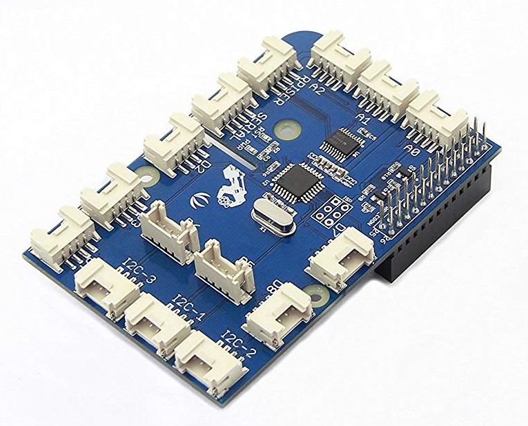
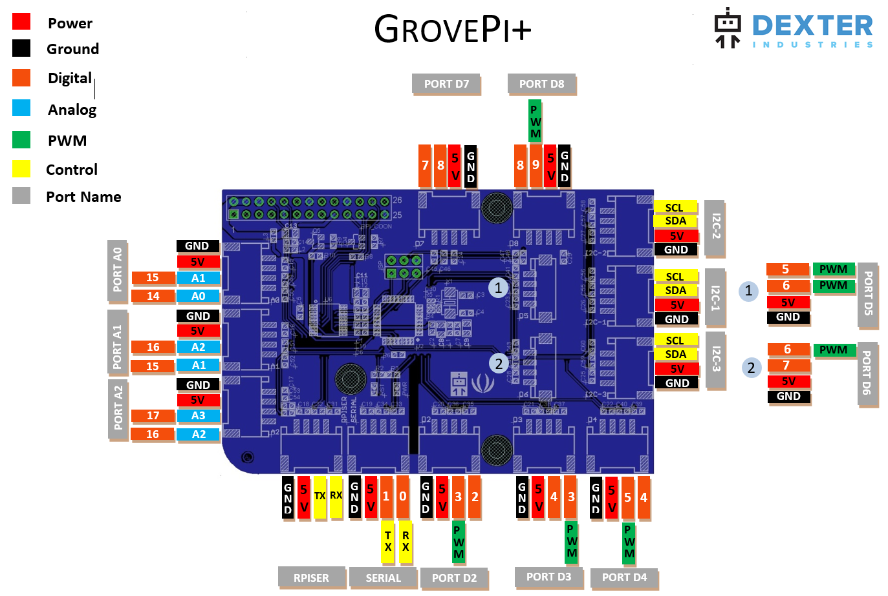

# GrovePi

## Summary

You will need a GrovePi+ from [Dexter Industries](https://www.dexterindustries.com/grovepi/) and a Raspberry Pi. That said, any board will work with the GrovePi+ as it is using I2C. You’ll just need to link the pins from your board to the GrovePi+ ones the correct way.

GrovePi+ have the ability to use Grove sensors, analogic, digital. GrovePi+ provide as well extensions for I2C sensors. In order to take advantage of GrovePi, you'll need Grove compatible sensors. There are lots existing like on [Seeed Studio](http://wiki.seeedstudio.com/Grove/).

- [Device family](./README.md#device-family)
- [GrovePi requirements](./README.md#make-sure-you-have-a-GrovePi+)
- [Know limitations](./README.md#known-limitations)
- [Using the driver](./README.md#how-to-use-the-driver)
  - [Accessing GrovePi information](./README.md#accessing-GrovePi-information)
  - [Accessing the sensors](./README.md#accessing-the-sensors)
- [Using high level classes](./README.md#how-to-use-the-high-level-classes)
- [Tests](./README.md#tests)

## Device family

The device supported is the GrovePi [Dexter Industries](https://www.dexterindustries.com/GrovePi/). It does implement all the features offered to read analogic sensors, digital sensors, write PWM and write digital values on pins. The supported version of GrovePi is only the version 3.



## Make sure you have a GrovePi+

There are multiple versions of GrovePi, this code is only working for the last version GrovePi+. We do recommend you to use as well the latest firmware of GrovePi. This binding is supposed to work starting at version 1.2 and has been tested with this older version. To update GrovePi firmware, please check the [GrovePi GitHub](https://github.com/DexterInd/GrovePi/blob/master/Firmware/firmware_update.sh). In short, you should clone it from Linux on a RaspberryPi and run the update script.

This code does not work with the Grove Base Hat.

## Known limitations

This version include a pure driver so you can directly access to the raw results. High level classes has been created for various sensors and has been tested. Please open a GitHub issue if you have any issue with any sensor. GrovePi has been tested with the following sensors:


High level classes has been built for those sensors. Generic Digital Input, Digital Output, Analogic Input, PWM Output has been built as well. You can build your own classes looking at the sensors provided in the [Sensors folder](./Sensors).

More sensors are supported and being tested like the Grove Led Bar. Note that this sensor as the Ultrasonic sensor have native support and accessing their data is different than for the other sensors.

## How to use the driver

The main [GrovePi samples](./samples) contains a series of test showing how to use some of the classes.

Create a ```GrovePi``` class.

```csharp
I2cConnectionSettings i2CConnectionSettings = new I2cConnectionSettings(1, GrovePi.GrovePiSefaultI2cAddress);
grovePi = new GrovePi(I2cDevice.Create(i2CConnectionSettings));
// Do something with the sensors
// At the end, the IEC Device will be disposed
```

If you want to use GrovePi on another board than the RaspberryPi and you may have to change the default I2C  bus, you can do it as well in the constructor. Please note that for Raspberry Pi, the default I2C chip is 1 and the default address is 0x04. The static ```GrovePi.GrovePiSefaultI2cAddress``` contains this address.

If you want to use multiple GrovePi, it's possible. You'll need to change the default address of the other GrovePi. Check the [documentation here](https://www.dexterindustries.com/GrovePi/programming/using-multiple-grovepis-together/).

### Accessing GrovePi information

The GrovePiInfo class offers information like the firmware version, manufacturer. You can easily access them like in the following code:

```csharp
I2cConnectionSettings i2CConnectionSettings = new I2cConnectionSettings(1, GrovePi.GrovePiSefaultI2cAddress);
grovePi = new GrovePi(I2cDevice.Create(i2CConnectionSettings));
Console.WriteLine($"Manufacturer :{grovePi.GrovePiInfo.Manufacturer}");
Console.WriteLine($"Board: {grovePi.GrovePiInfo.Board}");
Console.WriteLine($"Firmware version: {grovePi.GrovePiInfo.SoftwareVersion}");
```

### Accessing the sensors

If you are familiar with Ardunio programming, using GrovePi will look very familiar. The main functions you can use to access the Grove sensors are:

```csharp
public PinLevel DigitalRead(GrovePort pin);
public void DigitalWrite(GrovePort pin, PinLevel pinLevel);
public void PinMode(GrovePort pin, PinMode mode);
public int AnalogRead(GrovePort pin);
public void AnalogWrite(GrovePort pin, byte value);
```

Their usage is very similar to Arduino usage. For example, if you want to read an analogic pin, you will have to:

```csharp
// Set the pin as Input, should be done only once but you
// can change it as well over time
grovePi.PinMode(GrovePort.Grove1, PinMode.Input);
// Then read results, you can do it as much as you want
var result = grovePi.AnalogRead(GrovePort.Grove1);
```

As in Arduino, you will have to setup the type of port you want, Input or Output. Then read or write on it depending on its setup. Note that PWM is supported as well for PWM ports. Jut do an AnalogWrite on any PWM port to use the hardware PWM.

All pins are documented here:



As you can see in this schema, pins are used most of the cases on 2 Grove plugs. Most Grove sensors just use one pin, the yellow cable, the outside pin. But if your sensor like the Led Bar is using 2 pins, you will have to avoid using the Grove plug where the other pin is used.

Note that Analogic pins can be used for both analogic and digital sensors. In case you want to use them for digital operation, please use DigitalPin14, 15 and 16. They are respectively AnalogPin0, 1 and 2. You will note as well that not all pins are capable of PWM, so for actuators which needs to use PWM, please use only the PWM capable ports.

## How to use the high level classes

There are high level classes to handle directly sensors like analogic sensors, buzzers, leds, buttons. All the sensors are using only 1 pin out of the 2 available. There is nothing presenting you to use the 2 pins if you have a sensor using 2 pins. Just make sue you won't use the adjacent Grove plug in this case.

Using the sensor classes is straight forward. Just reference a class and initialized it. Access properties which are common to all sensors, ```Value``` and ```ToString()```.

Example creating an Ultrasonic sensor on Grove1 port:

```csharp
UltrasonicSensor ultrasonic = new UltrasonicSensor(grovePi, GrovePort.DigitalPin6);
while (!Console.KeyAvailable)
{
    Console.WriteLine($"Ultrasonic: {ultrasonic}");
    Thread.Sleep(2000);
}
```

## Tests

A series of hardware tests for sensors are available in [GrovePi.samples](./samples). Those hardware tests offers a variety of sensors.

```csharp
Console.WriteLine("Hello GrovePi!");
PinLevel relay = PinLevel.Low;
I2cConnectionSettings i2CConnectionSettings = new I2cConnectionSettings(1, GrovePi.GrovePiSefaultI2cAddress);
grovePi = new GrovePi(I2cDevice.Create(i2CConnectionSettings));
Console.WriteLine($"Manufacturer :{grovePi.GrovePiInfo.Manufacturer}");
Console.WriteLine($"Board: {grovePi.GrovePiInfo.Board}");
Console.WriteLine($"Firmware version: {grovePi.GrovePiInfo.SoftwareVersion}");
grovePi.PinMode(GrovePort.AnalogPin0, PinMode.Input);
grovePi.PinMode(GrovePort.DigitalPin2, PinMode.Output);
grovePi.PinMode(GrovePort.DigitalPin3, PinMode.Output);
grovePi.PinMode(GrovePort.DigitalPin4, PinMode.Input);
UltrasonicSensor ultrasonic = new UltrasonicSensor(grovePi, GrovePort.DigitalPin6);
DhtSensor dhtSensor = new DhtSensor(grovePi, GrovePort.DigitalPin7, DhtType.Dht11);
int poten = 0;
while (!Console.KeyAvailable)
{
    poten = grovePi.AnalogRead(GrovePort.AnalogPin0);
    Console.WriteLine($"Potentiometer: {poten}");
    relay = (relay == PinLevel.Low) ? PinLevel.High : PinLevel.Low;
    grovePi.DigitalWrite(GrovePort.DigitalPin2, relay);
    Console.WriteLine($"Relay: {relay}");
    grovePi.AnalogWrite(GrovePort.DigitalPin3, (byte)(poten * 100 / 1023));
    Console.WriteLine($"Button: {grovePi.DigitalRead(GrovePort.DigitalPin4)}");
    Console.WriteLine($"Ultrasonic: {ultrasonic}");
    dhtSensor.ReadSensor();
    Console.WriteLine($"{dhtSensor.DhtType}: {dhtSensor}");
    Thread.Sleep(2000);
    Console.CursorTop -= 5;
}

Console.CursorTop += 5;
```
