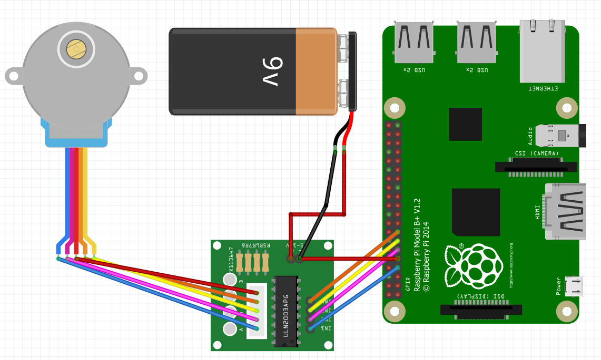

# Example of stepper motor 28BYJ-48

## Circuit


On scheme is used ULN2003APG driver. You can use  external power (9V as on scheme above) or just 5V Rapberry Pi PIN instead (Physical pin 2,4).

## Code

You can create a stepper motor with the following line:

```C#
Uln2003 motor = new Uln2003(bluePin, pinkPin, yellowPin, orangePin)
```
In the constructor, you will need to pass the number of used PINs.

```C#
// Pinout for Raspberry Pi 3
const int bluePin = 4;
const int pinkPin = 17;
const int yellowPin = 27;
const int orangePin = 22;

static void Main(string[] args)
{
    Console.WriteLine($"Let's go!");
    using (Uln2003 motor = new Uln2003(bluePin, pinkPin, yellowPin, orangePin))
    {
        while (true)
        {
            // Set the motor speed to 15 revolutions per minute.
            motor.RPM = 15;
            // Set the motor mode.  
            motor.Mode = StepperMode.HalfStep;
            // The motor rotate 2048 steps clockwise (180 degrees for HalfStep mode).
            motor.Step(2048);

            motor.Mode = StepperMode.FullStepDualPhase;
            motor.RPM = 8;
            // The motor rotate 2048 steps counterclockwise (360 degrees for FullStepDualPhase mode).
            motor.Step(-2048);

            motor.Mode = StepperMode.HalfStep;
            motor.RPM = 1;
            motor.Step(4096);
        }
    }
}
```